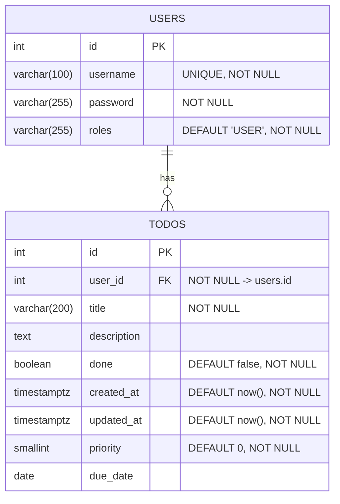

# Todo Java + React

これは、**Spring Boot（Java） + React（TypeScript）** を組み合わせたフルスタック Todo アプリです。  
JWT 認証、CI/CD、Docker、Render／Vercel による本番デプロイを含む学習・実践用プロジェクトです。

---

## 🚀 特長 / ポイント

- フルスタック構成（バックエンドとフロントエンドを分離）  
- 認証は JWT（トークンベース）方式  
- CI/CD に GitHub Actions を使用  
- コンテナ化：Dockerfile を用意  
- デプロイ先：Render（バックエンド + DB）、Vercel（フロントエンド）  
- DBマイグレーション：Flyway  
- モダンフロント技術：React + TypeScript、TanStack Query、React Hook Form、Tailwind CSS  

---

## 🧱 技術スタック

| 層 | 技術 / フレームワーク |
|---|-------------------------|
| バックエンド | Spring Boot, MyBatis, Java |
| 認証 / セキュリティ | JWT |
| データベース | PostgreSQL |
| DB マイグレーション | Flyway |
| フロントエンド | React, TypeScript, TanStack Query, React Hook Form, Tailwind CSS |
| CI / ビルド / デプロイ | GitHub Actions, Dockerfile, Render, Vercel |

---

## 📦 構成と動作イメージ
- フロントは API を呼び出してデータを取得・表示  
- 認証は JWT トークンを `Authorization: Bearer <token>` ヘッダで送信  
- バックエンドはステートレスに設計  
- CI によってビルド → Docker コンテナ化 → Render / Vercel に自動デプロイ  


---

## ER図


---

## 🛠️ セットアップ / ローカルでの起動方法

1. リポジトリをクローン  
   ```bash
   git clone https://github.com/miyagawa-git/todo-java-react.git
   cd todo-java-react
   ```
２．バックエンドの環境設定
todo-backend/src/main/resources/application.yml などで DB 接続情報を設定
PostgreSQL を起動
Flyway マイグレーションを自動的に適用

３．フロントエンド設定
todo-frontend/.env（もしくは .env.local） に API ベース URL をセット
例: VITE_API_BASE=http://localhost:8080

４．両方を起動
バックエンド：./gradlew bootRun（または mvn spring-boot:run）
フロントエンド：npm install → npm run dev

ブラウザで http://localhost:5173（または指定ポート）にアクセスして動作確認

📚 実装のポイント（抜粋）

JWT 認証のフィルタ設計・例外処理

SecurityConfig における CORS 設定・セッションポリシー

フロントの API 通信で Authorization ヘッダ付与

TanStack Query：データ取得・キャッシュ管理

React Hook Form：ログイン / 入力フォームのバリデーション

Route 保護（RequireAuth コンポーネント）

CI/CD：GitHub Actions によるビルド → デプロイ

Dockerfile によるイメージ作成

Render / Vercel による本番デプロイ設計

---

🌐 公開（デモ / 本番）リンクとソースコード

デモ URL：https://todo-java-react.vercel.app

🚧 注意点 / 制限事項

このプロジェクトは学習目的であり、本番向けのセキュリティ対策（例えば XSS / CSRF / トークン失効など）は完全ではありません
環境変数の安全管理が必要
無料枠利用環境ではコールドスタートや遅延が発生する可能性あり

import * as fs from "fs";
import * as path from "path";
import * as readline from "readline";
import { once } from "events";

type CsvValidationOptions = {
  hasHeader?: boolean;
  encoding?: BufferEncoding;
};

type ProcessResult = {
  totalCount: number;
  errorCount: number;
  duplicateCount: number;
  errorCsvPath: string;
};

type ValidationContext = {
  seenValues: Set<string>;
};

async function writeLineSafely(
  writer: fs.WriteStream,
  line: string
): Promise<void> {
  if (!writer.write(line)) {
    await once(writer, "drain");
  }
}

/**
 * CSV出力用エスケープ
 */
function escapeCsv(value: string): string {
  if (
    value.includes('"') ||
    value.includes(",") ||
    value.includes("\n") ||
    value.includes("\r")
  ) {
    return `"${value.replace(/"/g, '""')}"`;
  }
  return value;
}

/**
 * 1列CSV前提の値正規化
 * - trim
 * - 両端クォート除去
 * - CSV内の "" を " に戻す
 */
function normalizeSingleColumnValue(raw: string): string {
  const trimmed = raw.trim();

  if (trimmed.startsWith('"') && trimmed.endsWith('"')) {
    return trimmed.slice(1, -1).replace(/""/g, '"');
  }

  return trimmed;
}

/**
 * 形式チェック + 重複チェック
 *
 * 例:
 * - 必須
 * - 半角数字のみ
 * - 8桁固定
 * - 重複禁止
 */
function validateValue(
  value: string,
  context: ValidationContext
): string[] {
  const errors: string[] = [];

  if (value.length === 0) {
    errors.push("値が空です");
    return errors;
  }

  if (!/^\d+$/.test(value)) {
    errors.push("半角数字のみ入力してください");
  }

  if (value.length !== 8) {
    errors.push("8桁で入力してください");
  }

  // 重複チェック
  // 方針:
  // - 値が形式的に不正でも、重複仕様上チェックしたいなら実行
  // - 「形式エラー時は重複判定しない」仕様なら if (errors.length === 0) で囲う
  if (context.seenValues.has(value)) {
    errors.push("値が重複しています");
  } else {
    context.seenValues.add(value);
  }

  return errors;
}

/**
 * 1列CSVをストリームで読み込み、
 * その場でチェックしてエラーCSVを生成する最速寄り版
 */
export async function validateSingleColumnCsvFast(
  inputCsvPath: string,
  errorCsvPath: string,
  options: CsvValidationOptions = {}
): Promise<ProcessResult> {
  const { hasHeader = false, encoding = "utf8" } = options;

  const reader = fs.createReadStream(inputCsvPath, { encoding });
  const rl = readline.createInterface({
    input: reader,
    crlfDelay: Infinity,
  });

  const writer = fs.createWriteStream(errorCsvPath, { encoding: "utf8" });

  let physicalLineNumber = 0;
  let dataRowNumber = 0;
  let errorCount = 0;
  let duplicateCount = 0;

  const context: ValidationContext = {
    seenValues: new Set<string>(),
  };

  try {
    // ヘッダ出力
    await writeLineSafely(writer, "rowNumber,errorMessage,value\n");

    for await (const rawLine of rl) {
      physicalLineNumber++;

      // 先頭ヘッダ行を読み飛ばし
      if (hasHeader && physicalLineNumber === 1) {
        continue;
      }

      dataRowNumber++;

      const line =
        physicalLineNumber === 1 ? rawLine.replace(/^\uFEFF/, "") : rawLine;

      const value = normalizeSingleColumnValue(line);
      const errors = validateValue(value, context);

      if (errors.length === 0) {
        continue;
      }

      if (errors.includes("値が重複しています")) {
        duplicateCount++;
      }

      errorCount++;

      const outputLine =
        [
          dataRowNumber,
          escapeCsv(errors.join(" / ")),
          escapeCsv(value),
        ].join(",") + "\n";

      await writeLineSafely(writer, outputLine);
    }
  } finally {
    writer.end();
    await once(writer, "finish");
  }

  return {
    totalCount: dataRowNumber,
    errorCount,
    duplicateCount,
    errorCsvPath,
  };
}

/**
 * 実行例
 */
async function main(): Promise<void> {
  const inputCsvPath = path.resolve("./input.csv");
  const outputDir = path.resolve("./output");
  const errorCsvPath = path.join(outputDir, "error_records.csv");

  if (!fs.existsSync(outputDir)) {
    fs.mkdirSync(outputDir, { recursive: true });
  }

  const result = await validateSingleColumnCsvFast(
    inputCsvPath,
    errorCsvPath,
    {
      hasHeader: false,
      encoding: "utf8",
    }
  );

  console.log("処理結果:", result);
}

if (require.main === module) {
  main().catch((error) => {
    console.error("処理中にエラーが発生しました:", error);
    process.exit(1);
  });
}


----
import * as fs from "fs";
import * as readline from "readline";
import * as path from "path";
import { once } from "events";

type ValidationError = {
  rowNumber: number;
  message: string;
  value: string;
};

type CsvLoadOptions = {
  hasHeader?: boolean;
  encoding?: BufferEncoding;
};

type ValidationResult = {
  totalCount: number;
  errorCount: number;
  errorCsvPath: string;
};

/**
 * 1列CSVを Map<行番号, 値> に読み込む
 *
 * 想定:
 * - 1行につき1項目
 * - ヘッダ有無はオプションで切替
 * - 100,000件程度を想定
 */
export async function loadSingleColumnCsvToMap(
  inputCsvPath: string,
  options: CsvLoadOptions = {}
): Promise<Map<number, string>> {
  const { hasHeader = false, encoding = "utf8" } = options;

  const recordMap = new Map<number, string>();

  const stream = fs.createReadStream(inputCsvPath, { encoding });
  const rl = readline.createInterface({
    input: stream,
    crlfDelay: Infinity,
  });

  let physicalLineNumber = 0;
  let logicalRowNumber = 0;

  for await (const rawLine of rl) {
    physicalLineNumber++;

    // 先頭行をヘッダとしてスキップ
    if (hasHeader && physicalLineNumber === 1) {
      continue;
    }

    // BOM除去
    const line =
      physicalLineNumber === 1 ? rawLine.replace(/^\uFEFF/, "") : rawLine;

    logicalRowNumber++;

    // 1列CSV想定なので1行全体を値として扱う
    // 両端のダブルクォートがある場合は外す
    const normalizedValue = normalizeSingleColumnValue(line);

    recordMap.set(logicalRowNumber, normalizedValue);
  }

  return recordMap;
}

/**
 * 値の正規化
 * - 前後空白除去
 * - 両端のダブルクォート除去
 * - "" を " に戻す
 */
function normalizeSingleColumnValue(value: string): string {
  const trimmed = value.trim();

  if (trimmed.startsWith('"') && trimmed.endsWith('"')) {
    return trimmed.slice(1, -1).replace(/""/g, '"');
  }

  return trimmed;
}

/**
 * フォーマットチェック
 *
 * ここは業務要件に応じて差し替えてください。
 * 例として:
 * - 必須
 * - 半角数字のみ
 * - 8桁固定
 */
function validateValue(value: string): string[] {
  const errors: string[] = [];

  if (value.length === 0) {
    errors.push("値が空です");
    return errors;
  }

  if (!/^\d+$/.test(value)) {
    errors.push("半角数字のみ入力してください");
  }

  if (value.length !== 8) {
    errors.push("8桁で入力してください");
  }

  return errors;
}

/**
 * CSVエスケープ
 */
function escapeCsv(value: string): string {
  if (value.includes('"') || value.includes(",") || value.includes("\n")) {
    return `"${value.replace(/"/g, '""')}"`;
  }
  return value;
}

/**
 * 書き込みバックプレッシャ対応
 */
async function writeLineSafely(
  writer: fs.WriteStream,
  line: string
): Promise<void> {
  if (!writer.write(line)) {
    await once(writer, "drain");
  }
}

/**
 * Mapに読み込んだデータをフォーマットチェックし、
 * エラーCSVを逐次出力する
 */
export async function validateMapAndCreateErrorCsv(
  recordMap: Map<number, string>,
  errorCsvPath: string
): Promise<ValidationResult> {
  const writer = fs.createWriteStream(errorCsvPath, {
    encoding: "utf8",
  });

  let errorCount = 0;

  try {
    // ヘッダ
    await writeLineSafely(writer, "rowNumber,errorMessage,value\n");

    for (const [rowNumber, value] of recordMap) {
      const errors = validateValue(value);

      if (errors.length === 0) {
        continue;
      }

      errorCount++;

      const line = [
        rowNumber,
        escapeCsv(errors.join(" / ")),
        escapeCsv(value),
      ].join(",") + "\n";

      await writeLineSafely(writer, line);
    }
  } finally {
    writer.end();
    await once(writer, "finish");
  }

  return {
    totalCount: recordMap.size,
    errorCount,
    errorCsvPath,
  };
}

/**
 * 一連の処理をまとめた関数
 */
export async function processCsv(
  inputCsvPath: string,
  outputDir: string,
  options: CsvLoadOptions = {}
): Promise<ValidationResult> {
  const recordMap = await loadSingleColumnCsvToMap(inputCsvPath, options);

  const errorCsvPath = path.join(outputDir, "error_records.csv");

  return validateMapAndCreateErrorCsv(recordMap, errorCsvPath);
}

/**
 * 実行例
 */
async function main(): Promise<void> {
  const inputCsvPath = path.resolve("./input.csv");
  const outputDir = path.resolve("./output");

  if (!fs.existsSync(outputDir)) {
    fs.mkdirSync(outputDir, { recursive: true });
  }

  const result = await processCsv(inputCsvPath, outputDir, {
    hasHeader: false,
    encoding: "utf8",
  });

  console.log("処理結果:", result);
}

if (require.main === module) {
  main().catch((error) => {
    console.error("処理中にエラーが発生しました:", error);
    process.exit(1);
  });
}

---
function validateValueWithDuplicateCheck(
  value: string,
  seen: Set<string>
): string[] {
  const errors: string[] = [];

  if (value.length === 0) {
    errors.push("値が空です");
    return errors;
  }

  if (!/^\d+$/.test(value)) {
    errors.push("半角数字のみ入力してください");
  }

  if (value.length !== 8) {
    errors.push("8桁で入力してください");
  }

  if (seen.has(value)) {
    errors.push("値が重複しています");
  } else {
    seen.add(value);
  }

  return errors;
}
