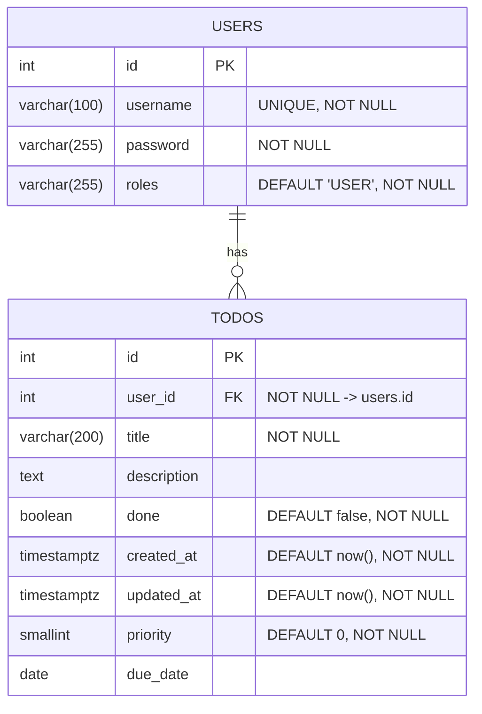

# Todo Java + React

これは、**Spring Boot（Java） + React（TypeScript）** を組み合わせたフルスタック Todo アプリです。  
JWT 認証、CI/CD、Docker、Render／Vercel による本番デプロイを含む学習・実践用プロジェクトです。

---

## 🚀 特長 / ポイント

- フルスタック構成（バックエンドとフロントエンドを分離）  
- 認証は JWT（トークンベース）方式  
- CI/CD に GitHub Actions を使用  
- コンテナ化：Dockerfile を用意  
- デプロイ先：Render（バックエンド + DB）、Vercel（フロントエンド）  
- DBマイグレーション：Flyway  
- モダンフロント技術：React + TypeScript、TanStack Query、React Hook Form、Tailwind CSS  

---

## 🧱 技術スタック

| 層 | 技術 / フレームワーク |
|---|-------------------------|
| バックエンド | Spring Boot, MyBatis, Java |
| 認証 / セキュリティ | JWT |
| データベース | PostgreSQL |
| DB マイグレーション | Flyway |
| フロントエンド | React, TypeScript, TanStack Query, React Hook Form, Tailwind CSS |
| CI / ビルド / デプロイ | GitHub Actions, Dockerfile, Render, Vercel |

---

## 📦 構成と動作イメージ
- フロントは API を呼び出してデータを取得・表示  
- 認証は JWT トークンを `Authorization: Bearer <token>` ヘッダで送信  
- バックエンドはステートレスに設計  
- CI によってビルド → Docker コンテナ化 → Render / Vercel に自動デプロイ  


---

## ER図


---

## 🛠️ セットアップ / ローカルでの起動方法

1. リポジトリをクローン  
   ```bash
   git clone https://github.com/miyagawa-git/todo-java-react.git
   cd todo-java-react
   ```
２．バックエンドの環境設定
todo-backend/src/main/resources/application.yml などで DB 接続情報を設定
PostgreSQL を起動
Flyway マイグレーションを自動的に適用

３．フロントエンド設定
todo-frontend/.env（もしくは .env.local） に API ベース URL をセット
例: VITE_API_BASE=http://localhost:8080

４．両方を起動
バックエンド：./gradlew bootRun（または mvn spring-boot:run）
フロントエンド：npm install → npm run dev

ブラウザで http://localhost:5173（または指定ポート）にアクセスして動作確認

📚 実装のポイント（抜粋）

JWT 認証のフィルタ設計・例外処理

SecurityConfig における CORS 設定・セッションポリシー

フロントの API 通信で Authorization ヘッダ付与

TanStack Query：データ取得・キャッシュ管理

React Hook Form：ログイン / 入力フォームのバリデーション

Route 保護（RequireAuth コンポーネント）

CI/CD：GitHub Actions によるビルド → デプロイ

Dockerfile によるイメージ作成

Render / Vercel による本番デプロイ設計

---

🌐 公開（デモ / 本番）リンクとソースコード

デモ URL：https://todo-java-react.vercel.app

🚧 注意点 / 制限事項

このプロジェクトは学習目的であり、本番向けのセキュリティ対策（例えば XSS / CSRF / トークン失効など）は完全ではありません
環境変数の安全管理が必要
無料枠利用環境ではコールドスタートや遅延が発生する可能性あり

〜〜〜〜〜〜〜〜
import * as fs from "fs";
import * as path from "path";
import * as readline from "readline";
import { once } from "events";

type InputFileDefinition = {
  columnName: string;
  filePath: string;
  order: number;
};

type MergeCsvOptions = {
  inputFiles: InputFileDefinition[];
  outputPath: string;
  encoding?: BufferEncoding;
};

type CsvCursor = {
  header: string;
  nextValue: () => Promise<IteratorResult<string>>;
  close: () => void;
};

const MAX_FILE_COUNT = 11;

function escapeCsv(value: string): string {
  if (
    value.includes(",") ||
    value.includes('"') ||
    value.includes("\n") ||
    value.includes("\r")
  ) {
    return `"${value.replace(/"/g, '""')}"`;
  }
  return value;
}

async function writeLineSafely(
  writer: fs.WriteStream,
  line: string
): Promise<void> {
  if (!writer.write(line)) {
    await once(writer, "drain");
  }
}

async function createCsvCursor(
  filePath: string,
  encoding: BufferEncoding
): Promise<CsvCursor> {
  const reader = fs.createReadStream(filePath, { encoding });

  const rl = readline.createInterface({
    input: reader,
    crlfDelay: Infinity,
  });

  const iterator = rl[Symbol.asyncIterator]();

  const headerResult = await iterator.next();
  if (headerResult.done || headerResult.value == null) {
    rl.close();
    reader.destroy();
    throw new Error(`ファイルが空です: ${filePath}`);
  }

  const header = headerResult.value.trim();

  return {
    header,
    nextValue: async () => {
      const result = await iterator.next();

      if (result.done) {
        return { done: true, value: undefined };
      }

      return {
        done: false,
        value: result.value.trimEnd(),
      };
    },
    close: () => {
      rl.close();
      reader.destroy();
    },
  };
}

async function mergeSingleColumnCsvFiles(
  options: MergeCsvOptions
): Promise<void> {
  const encoding = options.encoding ?? "utf-8";
  const outputPath = options.outputPath;

  if (options.inputFiles.length === 0) {
    throw new Error("入力ファイルが指定されていません。");
  }

  if (options.inputFiles.length > MAX_FILE_COUNT) {
    throw new Error(
      `入力ファイル数が上限を超えています。上限: ${MAX_FILE_COUNT}`
    );
  }

  // order順に並べ替え
  const sortedInputFiles = [...options.inputFiles].sort(
    (a, b) => a.order - b.order
  );

  for (const inputFile of sortedInputFiles) {
    if (!fs.existsSync(inputFile.filePath)) {
      throw new Error(`入力ファイルが存在しません: ${inputFile.filePath}`);
    }
  }

  fs.mkdirSync(path.dirname(outputPath), { recursive: true });

  const writer = fs.createWriteStream(outputPath, { encoding });
  const cursors: CsvCursor[] = [];

  try {
    for (const inputFile of sortedInputFiles) {
      const cursor = await createCsvCursor(inputFile.filePath, encoding);

      // 必要ならヘッダー名チェック
      if (cursor.header !== inputFile.columnName) {
        throw new Error(
          `ヘッダー名が不一致です。file=${inputFile.filePath}, expected=${inputFile.columnName}, actual=${cursor.header}`
        );
      }

      cursors.push(cursor);
    }

    // 出力ヘッダーは order順で並ぶ
    const outputHeaders = sortedInputFiles.map((file) =>
      escapeCsv(file.columnName)
    );
    await writeLineSafely(writer, outputHeaders.join(",") + "\n");

    let rowNumber = 2;

    while (true) {
      const rowResults = await Promise.all(
        cursors.map((cursor) => cursor.nextValue())
      );

      const doneCount = rowResults.filter((result) => result.done).length;

      if (doneCount === rowResults.length) {
        break;
      }

      if (doneCount > 0 && doneCount < rowResults.length) {
        throw new Error(
          `ファイルの行数が一致しません。CSV行番号: ${rowNumber}`
        );
      }

      const mergedRow = rowResults
        .map((result) => escapeCsv(result.value ?? ""))
        .join(",");

      await writeLineSafely(writer, mergedRow + "\n");
      rowNumber++;
    }
  } finally {
    for (const cursor of cursors) {
      cursor.close();
    }

    writer.end();
    await once(writer, "finish");
  }
}

async function main(): Promise<void> {
  const inputFiles: InputFileDefinition[] = [
    {
      columnName: "city",
      filePath: "./input/city.csv",
      order: 3,
    },
    {
      columnName: "name",
      filePath: "./input/name.csv",
      order: 1,
    },
    {
      columnName: "age",
      filePath: "./input/age.csv",
      order: 2,
    },
  ];

  await mergeSingleColumnCsvFiles({
    inputFiles,
    outputPath: "./output/merged.csv",
  });

  console.log("結合完了");
}

main().catch((error) => {
  console.error("エラー:", error);
  process.exit(1);
});

